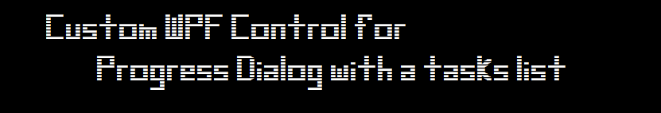
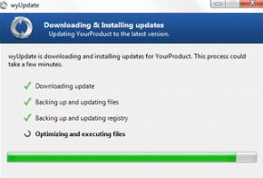
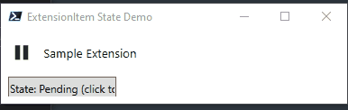
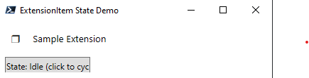
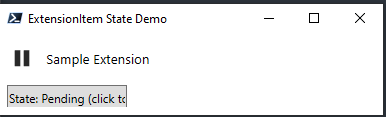
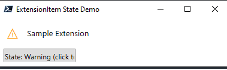
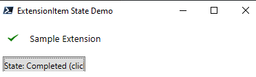
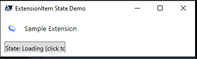

A custom WPF control to create a tasks-list type Progress Dialog like in Windows 7 with checkboxes and progress animation. Here's my inpiration:

### Purpose 

### States

**Idle**

**Pending**

**WArning**

**Completed**

**Loading**

