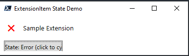
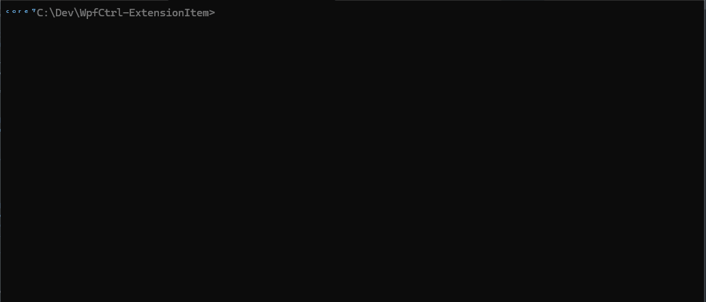

<center>

</center>

# Custom WPF Task Progress Dialog Control

A custom WPF control to create a **tasks-list style progress dialog**, inspired by Windows 7/wyUpdate with animated progress, state icons, and clear status for each operation.

Here's the classic inspiration:


---

## Purpose

This control is designed for modern WPF applications that need to show progress over multiple sequential (or parallel) tasks, with a user-friendly, visually clear, and instantly recognizable interface.

It replicates the familiar software update dialogs, featuring:
- Task checklists with animated or static state icons
- A progress bar for total completion
- Support for *Idle*, *Pending*, *Loading*, *Warning*, *Error*, and *Completed* visual states
- Full control from C#, PowerShell, or XAML code-behind

---

## Features

- ✔️ **Per-task status icons**: pause, spinner, tick, warning, error, idle
- 🔄 **Animated spinner** for in-progress tasks
- 🟩 **Green checkmark** for completed tasks
- ⚠️ **Warning** and ❌ **Error** states for problematic tasks
- ❒ **Idle** state for tasks not yet started
- 📝 **Easily controlled** from both code and XAML
- 🖥️ **Lightweight**—no dependencies except .NET/WPF

---

## Visual States


Each task can display one of the following states:

### Idle


**Description:** The task is ready to start or has not yet started.

---

### Pending


**Description:** The task is scheduled and waiting to be processed (pause icon).

---

### Warning


**Description:** The task encountered a warning (⚠️). Execution may continue, but user attention may be required.

---

### Error



**Description:** The task has failed (❌). User or program intervention is required.

---

### Loading


**Description:** The task is currently running, with an animated spinner.

---

### Completed


**Description:** The task completed successfully (green checkmark).

---

## Usage

Add your control to any WPF window or dialog and set each task's status from your code (C#, PowerShell, etc):

```csharp
// C# Example
myExtensionItem.Status = ExtensionStatus.Loading;
myExtensionItem.ExtensionLabel = "Downloading update...";


## PowerShell Test & Integration Functions

The project includes a set of **PowerShell helper functions** (see `Show-TestDialog.ps1`) for rapid development, testing, and automation scenarios. These scripts allow you to load your compiled control, verify assembly registration, and interactively demo all visual states.

### Functions

#### `Get-ExtensionControlDllPath`

Searches for your compiled control DLL in Debug/Release output directories, supporting both targeted and "Any" configurations.
Returns the path of the first matching assembly found.

#### `Register-ExtensionControlDll`

Loads the compiled WPF control assembly into the current PowerShell session (if not already loaded), ensuring all .NET types are available for use.
Handles Debug/Release/Any modes automatically.

#### `Test-ExtensionControlLoaded`

Checks if the control's types (like `[WebExtensionPack.Controls.ExtensionStatus]`) are already loaded in the current session.
Returns `$True` or `$False`.

#### `Show-ExtensionItemDialog`

Launches a test dialog window containing a single `ExtensionItem` control and a button to cycle through all available states (`Idle`, `Pending`, `Warning`, `Error`, `Loading`, `Completed`).

* Dynamically updates the control’s icon and label.
* Lets you visually verify every UI state in real time.

**Example usage:**

```powershell
. .\Show-TestDialog.ps1
Show-ExtensionItemDialog
```

## Registering Scripts Dependenvies

We are all a little bit lazy, and so when we ride the fine line between having clean, separated scripts by types and be able to include all the scripts quickly...
We use a command that will source all the scripts in one go, without merging the scripts in one ugly file. [like this](img/deps2.png)
```powershell 
ᶜᵒʳᵉ⁷C:\Dev\WpfCtrl-ExtensionItem>.\scripts\Register-Dependencies.ps1 

  ✔️ successfully sourced       Get-ExtensionControlDllPath.ps1
  ✔️ successfully sourced       Get-WpfExtensionCtrl.ps1
  ✔️ successfully sourced       Register-Control.ps1
  ✔️ successfully sourced       Show-TestDialog.ps1
```

If there's a error in one of the script, you will get a notification [like this](img/error_details.png)

```powershell
ᶜᵒʳᵉ⁷C:\Dev\WpfCtrl-ExtensionItem> .\scripts\Register-Dependencies.ps1
  ✔️ successfully sourced       Get-ExtensionControlDllPath.ps1
  ❌ Found Error                        Get-WpfExtensionCtrl.ps1
  ✔️ successfully sourced       Register-Control.ps1
  ✔️ successfully sourced       Show-TestDialog.ps1
  ```

The ```ErrorDetails``` argument can be used to go through all the errors and list the stack and details...:



## Settings Page - Design - List of the Configuration Values

**Category - General**
 - Log Level
 - Log File Path
 - Log Channels (Gui/File/Events)
 - Record Network Statistics
 - Temporary Directory (staging area when downloading, deciphering, and reconstructing the binary data)
 - Final Destination Directory for Packages
 - Autorun Package Command
 - Version Check on Start
 - Auto Update Enabled/Disabled
 - Message of the Day Enabled/Disabled

**Data Validation**
 - Signature Verification Required
 - Package Digest Required

**Category - Network**
 - Transfer Mode - BITS TRANSFER, Aria2c, WGet, Web Requests
 - MAx Parallel Jobs
 - Priority
 - RetryInterval
 - RetryTimeout
 - MaxDownloadTime
 - ProxyAuthentication
 - ProxyBypass
 - ProxyCredential
 - ProxyUsage
 - ProxyLisy
 - NotifyFlags None, JobError, JobTransferred, Disable
 - NotifyCmdLine

**Category - Stats**
 - Generate Error Report on Error
 - Gather System Information

**License**
 - Username
 - Company Name
 - License Key

